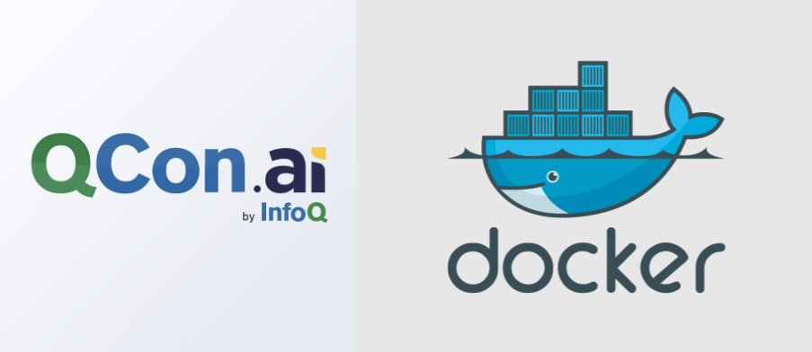

# Docker-izing your Data Science Apps - QCon AI CodeLab 2018

This repo includes all of the materials and documentation that you will need for the "Docker-izing your Data Science Apps" CodeLab at QCon AI 2018.  In this CodeLab, we will learn how to put your data science applications in Docker images and run those as containers on any infrastructure. These skills will help you maintain reproducibility and increase efficiency as you deploy your applications, and they will help you standardize your code to better fit into modern infrastructures, CI/CD tools, and DevOps practices. 

The CodeLab is compiled such that it can be completed independently. To start, read the [Getting Started](#getting-started) section and then follow the first link below (`1. Installing and...`). If you have any difficulties or questions, the instructor [Daniel Whitenack](https://twitter.com/dwhitena) will be holding office hours at QCon AI on [Tuesday, April 10th](https://qcon.ai/schedule/qconai2018/tabular).

## Agenda

1. [Installing and testing Docker](installing_docker)
1. ["Dockeri-izing" model training](model_training)
2. [Docker-izing inference, services](inference)
3. [Managing and scaling Docker-ized data science apps](managing_and_scaling)

## Getting Started

- To complete this CodeLab, you will need to have:
    - A laptop/desktop capable of running Docker (see requirements [here](https://docs.docker.com/install/))
    - A Unix-like terminal (ideally the [WSL on Windows](https://docs.microsoft.com/en-us/windows/wsl/install-win10) although similar operations could be accomplished using the Windows command prompt)
    - A connection to the Internet

- If you are new to the command line or need a refresher, look through [this quick tutorial](https://lifehacker.com/5633909/who-needs-a-mouse-learn-to-use-the-command-line-for-almost-anything).
